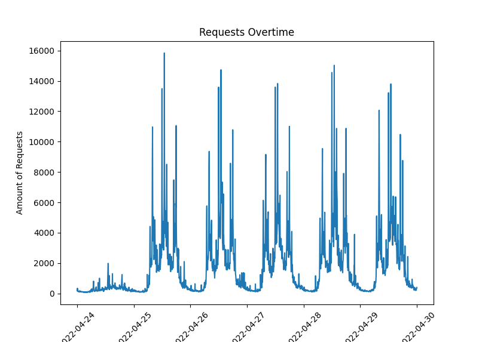
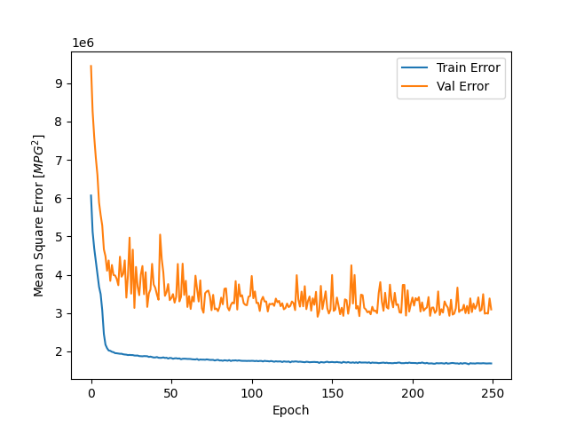
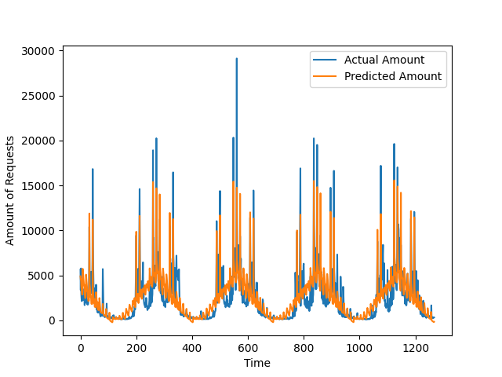
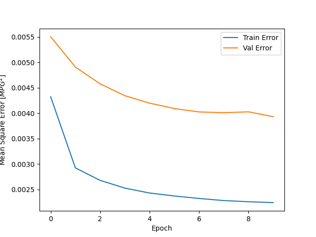
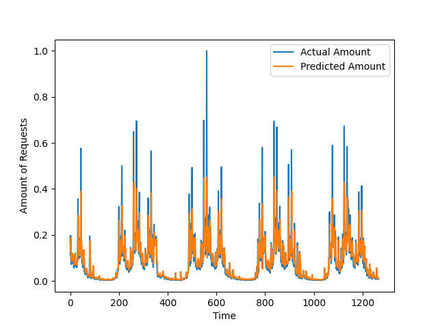

# Requests Prediction

>Given the amount of requests for a period of time, is it possible to predict how many requests will occur in a future time?
>
>In theory, yes. This kind of data is described as a time series and can be written as a regression problem. There are many ways to approach regression problems, one of them is to use machine learning.
>
>There are a bunch of machine learning techniques that could be used to solve this problem, in this repo we will try to solve the problem using two strategies:
>
>- using "classic" feature extraction and feeding the extracted data to a `neural network`; 
>- using `LSTM`, a very popular `recurrent neural network` architecture used in Natural Language Processing and time series;

## The Data

>Our data has two columns. These data were obtained filtering the amount of requests that happened in a web platform every five minutes.
>1. The `datetime` value;
>2. The `amount` of requests that occured in that datetime;

>- Dataset shape: `(17856, 2)`
>- Min amount of requets was `49` and happened on `2022-05-02 04:15:00`
>- Max amount of requets was `29123` and happened on `2022-06-08 13:00:00`

## Classic Machine Learning

Since we only have the response we want to achieve (the `amount`) and the `datetime`, some info had to be obtained from context, i.e. how is the system actually used?

1. From context, we know that in the weekends the amount of people using the system is substantially different from week days, so it was decided to keep those days out of the analysis;
2. In the same way, holidays are very different from a common week day, but since they often happen on week days, they were kept on the final data, but flagged;
3. There are some specific times in a day when the amount of requests is significantly bigger than others, those datetimes were flagged as `super peaks` and `mini peaks`;
4. Other features were `datetime` related, such as `day`, `month`, `hour`, `minute`.

After extracting the seven features described above, they were inputed to a simple `feedforward neural network` with three `hidden layers` containing 8, 8 and 6 neurons respectively.
All layers had `relu` activation function and the network was trained for `250 epochs` using `RMSprop` as it's optmizer function.

The data was split in `[0.7 for training, 0.2 for validation and 0.1 for testing]`.

Bellow we have the mean squared error of the neural network.

And also the comparison of the predicted data versus the actual data.

### Long Short-Term Memory (LSTM [1])

LSTM are a particular neural network architeture that can use past data to predict results about the future. The most correct description can be found in the original paper [1] but this web page has a very solid intuition: `https://www.deeplearningbook.com.br/arquitetura-de-redes-neurais-long-short-term-memory/`.

The input is a little different. Instead of giving features like before, we will input the date about a given moment t and the following k moments. So, for every instance we will have k + 1 events.

The network was trained faster with only 10 epochs and used `Adam` as it's activation function.

Bellow we have the mean squared error of the neural network.

And also the comparison of the predicted data versus the actual data.

The problem is yet not solved. The LSTM is pretty accurate for describing the shape of the function that measures the amount of requests but still fails on predicting the peaks. One possible solution is to chain more LSTM layers.
